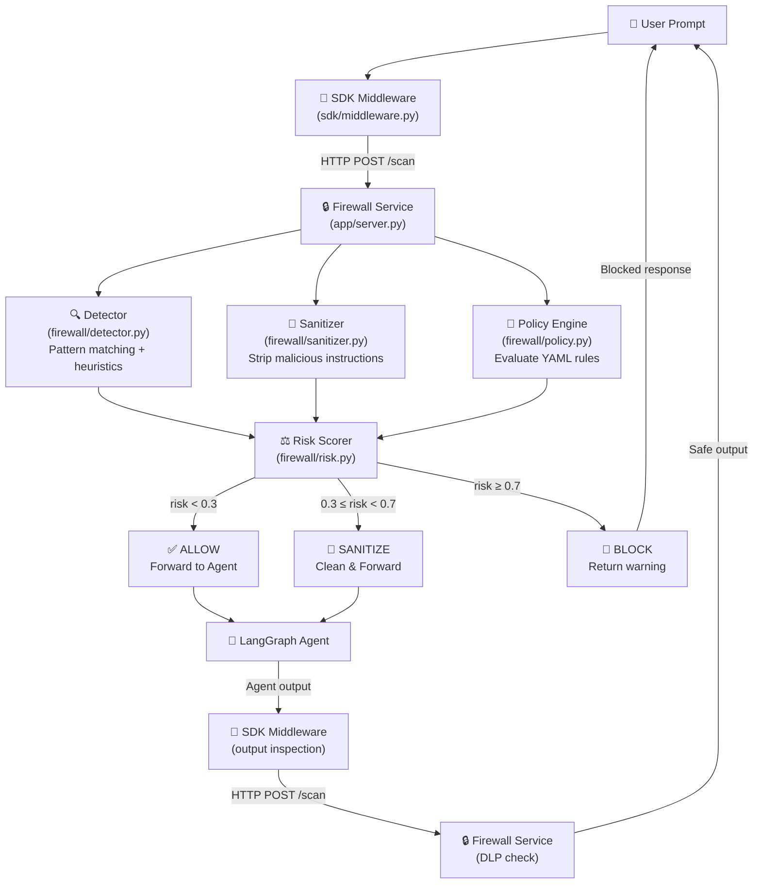

# Agentic Cognitive Firewall SDK — System Architecture

## Overview

The system has **two parts** that work together:

| Component | What It Is | Runs As |
|---|---|---|
| **Firewall Service** | A FastAPI server that scans content and returns allow/block decisions | A standalone microservice (`app/server.py`) |
| **SDK (Middleware)** | A Python library that plugs into any LangGraph/LangChain agent to auto-intercept messages | An importable Python package (`sdk/middleware.py`) |

The developer installs the SDK into their agent. The SDK automatically sends every prompt/tool-output to the Firewall Service for scanning. The agent only proceeds if the Firewall says "ALLOW."

## Data Flow



## What Gets Scanned

The Firewall doesn't just scan the user's prompt. It scans **6 types of content**:

| Content Type | Where It Comes From | Why It's Dangerous |
|---|---|---|
| **User prompts** | The user types something | Prompt injection attacks |
| **RAG documents** | Retrieved from a vector database | An attacker could poison the knowledge base with hidden instructions |
| **Tool outputs** | External API calls (web search, database queries) | A malicious website could return instructions embedded in its HTML |
| **Memory writes** | The agent saving context to long-term memory | An attacker could inject instructions that persist across sessions |
| **System prompts** | The developer's base instructions | Detecting accidental leaks of system prompts in outputs |
| **Agent outputs** | The AI's final response | Preventing the AI from leaking PII (names, emails, SSNs) |

## Component Responsibilities

### 1. Detector (`firewall/detector.py`) ✅ DONE
- **Phase 1:** Regex pattern matching against 6 known attack categories
- **Phase 2:** Heuristic scoring (prompt length, special char ratio, imperative density)
- **Output:** `DetectionResult` with `pattern_score`, `heuristic_score`, `matched_patterns`

### 2. Sanitizer (`firewall/sanitizer.py`)
- Strips known injection delimiters (`[INST]`, `<|system|>`, etc.)
- Removes imperative sentences from RAG documents
- Returns cleaned text + a log of what was removed

### 3. Policy Engine (`firewall/policy.py`)
- Loads rules from `policies/default.yaml`
- Evaluates each rule against the incoming content
- Rules look like this:
```yaml
rules:
  - name: "block_password_requests"
    match: "password|credential|secret"
    action: BLOCK
  - name: "max_prompt_length"
    condition: "length > 2000"
    action: SANITIZE
```

### 4. Risk Scorer (`firewall/risk.py`)
- Combines scores from Detector + Sanitizer + Policy Engine
- Weights: Detection (50%) + Policy violations (30%) + Heuristics (20%)
- Returns final verdict: `ALLOW` / `SANITIZE` / `BLOCK`

### 5. FastAPI Server (`app/server.py`)
- `POST /scan` — Main endpoint. Accepts content, runs full pipeline, returns verdict
- `GET /health` — Health check
- `POST /evaluate` — Batch scan multiple content items
- All decisions are logged with timestamps for audit trails

### 6. SDK Middleware (`sdk/middleware.py`)
- A Python decorator/wrapper for LangGraph agents
- Automatically intercepts `invoke()` calls
- Sends content to the Firewall Service via HTTP
- Blocks execution if the Firewall returns `BLOCK`

## Tech Stack

| Layer | Technology |
|---|---|
| API Framework | FastAPI + Uvicorn |
| Detection | Python regex + heuristic scoring |
| Policy Engine | PyYAML |
| Agent Integration | LangGraph + LangChain |
| HTTP Client | httpx (async) |
| Data Validation | Pydantic |
